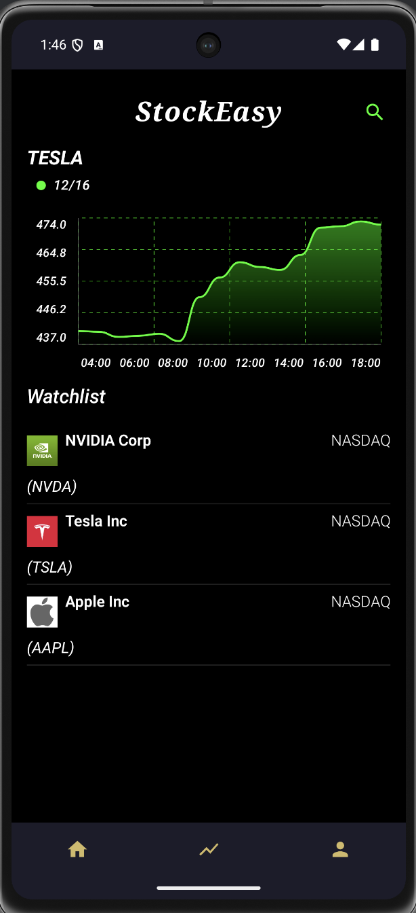
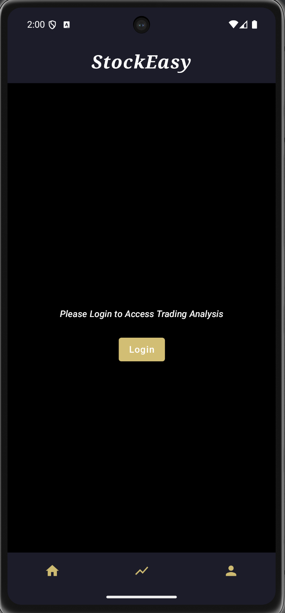
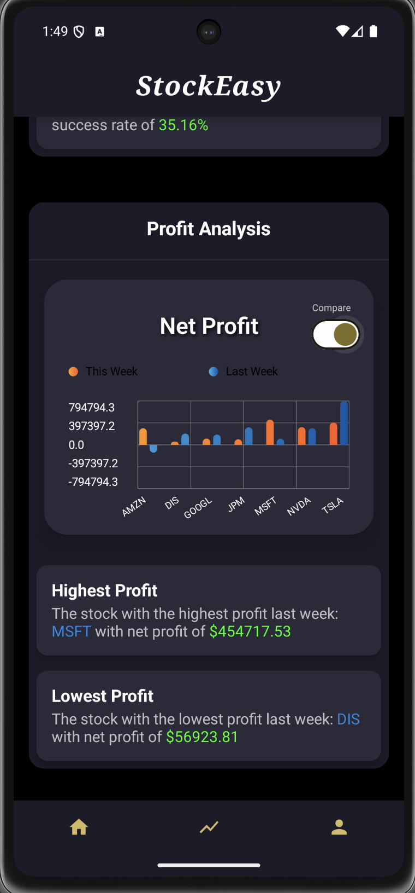
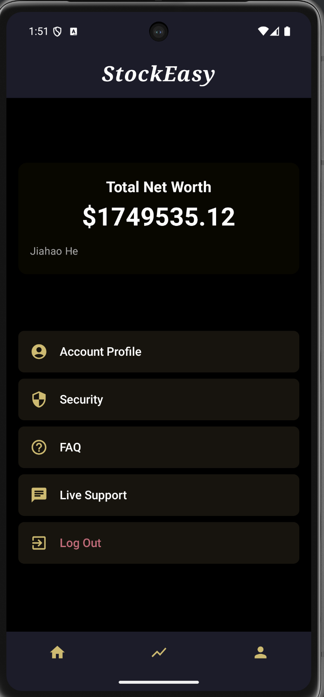

# 📊 **StockEasy**: Real-Time Stock Market Analysis App

A powerful **stock market analysis** app built with **Jetpack Compose**, **Hilt**, and **Retrofit**. **StockEasy** provides real-time data visualization, watchlist management, and cutting-edge AI-driven trading insights, empowering users to make data-driven investment decisions.

---

## 🌟 **Key Features**

### 🔹 **Real-Time Stock Data**
- Fetch intraday, weekly, and monthly stock data using the **Alpha Vantage API**.
- Visualize data through interactive **charts** with smooth animations.

### 🔹 **Watchlist Management**
- Create a personalized watchlist to monitor your favorite stocks.
- Add or remove companies with a single tap.

### 🔹 **Company Listings**
- Search and filter from a comprehensive **Nasdaq stock database**.
- Access detailed company information, including sector, industry, and performance metrics.

### 🔹 **AI-Powered Trading Insights**
- Leverage **OpenAI GPT-3.5** to analyze trading data and generate actionable insights.
- Identify trends, active trading periods, and opportunities based on historical data.

### 🔹 **User Behavior Analysis**
- Weekly analysis of trading activity: **total trades**, **sector performance**, and most traded stocks.
- Detailed breakdown of **buying** and **selling patterns**.

### 🔹 **Offline Support**
- Seamlessly cache stock data using **Room Database** for offline access.

### 🔹 **Secure User Authentication**
- Manage user accounts securely with **Firebase Authentication**.

---

## 🛠️ **Tech Stack**

### **Frontend**
- **Kotlin**: Core development language.
- **Jetpack Compose**: Modern UI toolkit for a clean, responsive interface.
- **Compose Destinations**: Type-safe and structured navigation.
- **Accompanist**: Enhances UI capabilities like swipe refresh and animations.
- **ComposeChart**: Elegant chart visualizations for trading data.

### **Backend**
- **Retrofit**: Networking library for seamless API integrations.
- **OkHttp**: Handles HTTP requests for stock data streaming.
- **Room Database**: Local storage for caching and offline support.

### **AI Integration**
- **OpenAI GPT-3.5**: Generates actionable trading insights and weekly summaries.

### **Other Tools**
- **Hilt**: Dependency injection for clean and modular architecture.
- **OpenCSV**: Parses and processes large CSV datasets.

---

## 💻 **Screenshots**

### Main Screen


### Search Screen


### Company Details 1


### Company Details 2


### Analysis Screen 1


### Analysis Screen 2


### Analysis Screen 3


### Login Screen 1


### Login Screen 2


---

## 🚀 **How It Works**

1. **Stock Data Fetching**:  
   - Real-time stock data is fetched using **Alpha Vantage** API.
   - Data is parsed with **OpenCSV** and stored locally using **Room**.

2. **AI Insights Generation**:  
   - Trading data is analyzed for patterns (active times, most traded stocks).
   - Summaries and trading suggestions are generated using **GPT-3.5**.

3. **User Authentication**:  
   - Firebase Authentication ensures secure login and user data management.

---

## 📋 **Upcoming Features**

### ✅ **Weekly AI Summaries**
- Generate automated weekly reports using AI.  
- Users will receive notifications and access reports from their profile.

### ✅ **Robinhood Integration**
- Integrate real **Robinhood API** to fetch user portfolios.  
- Analyze real-time portfolio performance.

### ✅ **Enhanced Risk Management**
- Statistical risk analysis with visual insights.  
- Introduce tools for **asset allocation analysis** and **risk warnings**.

---

## 🔑 **Setup Instructions**

1. Clone this repository


2. Add your API keys in the `local.properties` file:
   ```properties
   OPENAI_API_KEY=your_openai_api_key
   ```

3. Build and run the app:
   - Ensure **Android Studio** (Arctic Fox or newer) is installed.
   - Open the project and sync dependencies.

4. Configure Firebase Authentication:
   - Follow the [Firebase setup guide](https://firebase.google.com/docs/auth) and connect your Firebase project.

---

## ⚙️ **Dependencies**

Add these dependencies in your `build.gradle`:

```gradle
dependencies {
    implementation(platform("com.google.firebase:firebase-bom:32.2.2"))

    implementation("androidx.core:core-ktx:1.7.0")
    implementation("androidx.compose.ui:ui:$compose_version")
    implementation("androidx.compose.material:material:$compose_version")
    implementation("androidx.compose.ui:ui-tooling-preview:$compose_version")
    implementation("androidx.lifecycle:lifecycle-runtime-ktx:2.3.1")
    implementation("androidx.activity:activity-compose:1.6.0")
    implementation 'androidx.compose.material3:material3-android:1.3.1'

    testImplementation("junit:junit:4.13.2")
    androidTestImplementation("androidx.test.ext:junit:1.1.3")
    androidTestImplementation("androidx.test.espresso:espresso-core:3.4.0")
    androidTestImplementation("androidx.compose.ui:ui-test-junit4:$compose_version")
    debugImplementation("androidx.compose.ui:ui-tooling:$compose_version")

    coreLibraryDesugaring("com.android.tools:desugar_jdk_libs:1.1.5")

    implementation("com.opencsv:opencsv:5.5.2")
    implementation("androidx.lifecycle:lifecycle-viewmodel-compose:2.4.1")
    implementation("androidx.compose.material:material-icons-extended:$compose_version")
    implementation("com.google.accompanist:accompanist-swiperefresh:0.24.2-alpha")

    implementation("io.github.raamcosta.compose-destinations:core:1.1.2-beta")
    ksp("io.github.raamcosta.compose-destinations:ksp:1.1.2-beta")

    implementation("com.google.dagger:hilt-android:2.48")
    kapt("com.google.dagger:hilt-android-compiler:2.48")

    implementation "androidx.hilt:hilt-navigation-compose:1.0.0"
    implementation "androidx.navigation:navigation-compose:2.6.0"
    kapt "com.google.dagger:hilt-android-compiler:2.48"
    implementation 'androidx.lifecycle:lifecycle-viewmodel-ktx:2.2.0-alpha04'

    implementation("com.squareup.retrofit2:retrofit:2.9.0")
    implementation("com.squareup.retrofit2:converter-moshi:2.9.0")
    implementation("com.squareup.okhttp3:okhttp:5.0.0-alpha.3")
    implementation("com.squareup.okhttp3:logging-interceptor:5.0.0-alpha.3")

    implementation("androidx.room:room-runtime:2.5.1")
    kapt("androidx.room:room-compiler:2.5.1")
    implementation("androidx.room:room-ktx:2.5.1")

    implementation("io.coil-kt:coil-compose:2.2.2")

    implementation("com.google.android.gms:play-services-auth:19.2.0")
    implementation("com.google.firebase:firebase-auth-ktx:21.0.0")
    implementation("org.jetbrains.kotlinx:kotlinx-coroutines-play-services:1.6.4")
    implementation("com.google.firebase:firebase-database:20.0.4")

    implementation("io.github.ehsannarmani:compose-charts:0.1.0")

    implementation "com.google.accompanist:accompanist-systemuicontroller:0.16.1"

}
```


